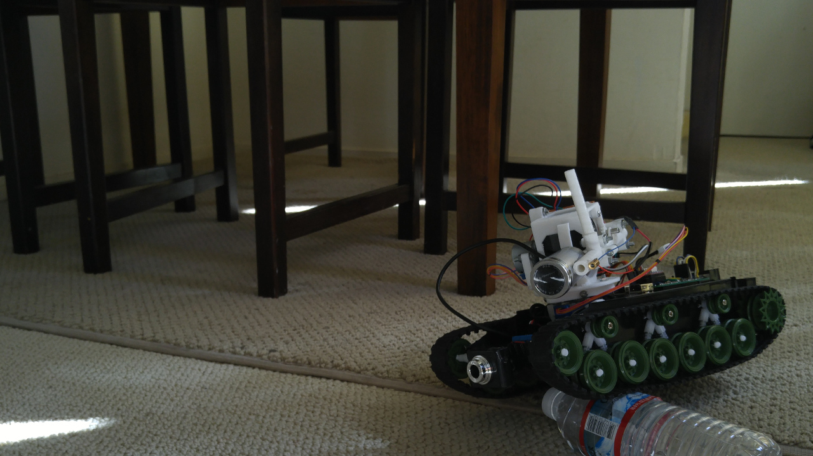

Personal Invasion Emulator 4000
===============================

_For that moment when you reeeally want to blitzkrieg but don't have the resources, so you have to make do with a $100 robot_

This robot is an attempt to make a remotely-operated tank that can shoot and shoot again. It is controlled from a webpage hosted by the Raspberry Pi.

## Required programs to run it
- [Python 3.6.1](https://www.python.org/) because python
- [Pi Blaster](https://github.com/sarfata/pi-blaster) drives the motors
- [MJPG Streamer](https://github.com/jacksonliam/mjpg-streamer) controls the cameras

## Architecture
The user interacts directly with the Raspberry Pi. The webpage provided decodes the user input into left and right motor speeds, turret angles, laser levels, and gun firing. The Pi has direct control over the cameras, drive, and yaw gimbal stepper. It sends commands over I^2^C to the Arduino, which controls the firing, pitch gimbal stepper, and laser pointer.

## Materials
Object								| Source			| Estimated Cost
---									| ---				| --:
Tank chassis 						| A seller on eBay 	| $25
Raspberry Pi 						| Amazon			| $35
Arduino Pro Mini (clone)			| eBay				| $2
NEMA 17 stepper motor				| eBay				| $10
Hacked 28BYJ-48s (now bipolar)		| eBay				| $5
Stepsticks							| eBay				| $3
H-Bridge							| eBay				| $2
Mechanical parts in the gun 		| 3D Printed 		| $2
Mounting plates for electronics 	| 3D Printed 		| $0.25
Various other electronics			| eBay				| $10 at most
**TOTAL**							|					| **$94.25**